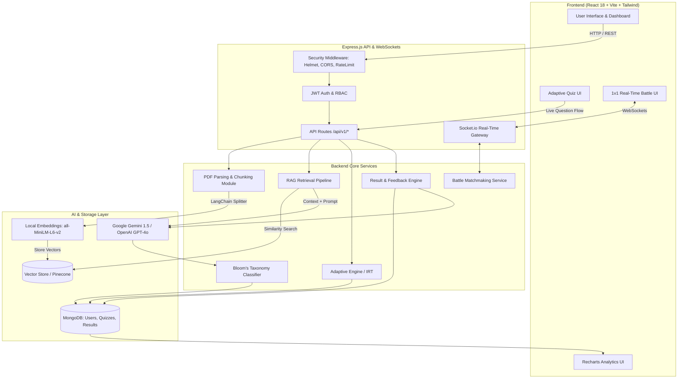

# 🧠 QuizMaster AI

<div align="center">


**An intelligent, adaptive learning and quiz platform powered by Retrieval-Augmented Generation (RAG), Bloom's Cognitive Taxonomy, and real-time multiplayer gamification.**

[](https://nodejs.org)
[](https://expressjs.com)
[](https://reactjs.org)
[](https://vitejs.dev)
[](https://tailwindcss.com)
[](https://www.mongodb.com)
[](https://socket.io)
[](https://ai.google.dev)
[](LICENSE)

[Features](#-key-features) • [Architecture](#-system-architecture) • [Tech Stack](#-tech-stack) • [Getting Started](#-getting-started) • [Environment Variables](#-environment-variables) • [API Overview](#-api-endpoints-overview) • [Detailed Documentation](#-detailed-documentation)

---

</div>

## 📖 Table of Contents

- [Overview](#-overview)
- [Key Features](#-key-features)
- [System Architecture](#-system-architecture)
- [Tech Stack](#-tech-stack)
- [Project Structure](#-project-structure)
- [Getting Started](#-getting-started)
  - [Prerequisites](#prerequisites)
  - [Backend Setup](#1-backend-setup)
  - [Frontend Setup](#2-frontend-setup)
- [Environment Variables](#-environment-variables)
- [API Endpoints Overview](#-api-endpoints-overview)
- [Detailed Documentation](#-detailed-documentation)
- [Contributing](#-contributing)
- [License](#-license)

---

## 🌟 Overview

**QuizMaster AI** transforms static learning materials into interactive, hyper-personalized learning journeys. By combining **Retrieval-Augmented Generation (RAG)** with large language models (Google Gemini 1.5 and OpenAI GPT-4o), QuizMaster AI ingests educational documents (such as textbooks, slides, and notes in PDF format), indexes their semantic context, and generates high-fidelity, pedagogically sound quizzes.

Unlike static quiz generators, QuizMaster AI implements an **Adaptive Quiz Engine** that dynamically adjusts question difficulty in real time based on student response patterns and response velocity, classified according to **Bloom's Revised Taxonomy**. Coupled with **Live 1v1 Quiz Battles** and gamified progression, QuizMaster AI provides an engaging, retention-optimized assessment platform for students and educators alike.

---

## ✨ Key Features

### 📄 1. RAG-Powered Document Ingestion
- **Document Processing**: Upload PDFs (up to 10MB) with automatic text extraction via `pdf-parse`.
- **Smart Chunking**: LangChain `RecursiveCharacterTextSplitter` segments content into semantically coherent fragments with configurable overlap.
- **Offline & Local Embeddings**: Built-in integration with `@xenova/transformers` (`all-MiniLM-L6-v2`) enables free, fast, local embedding generation without third-party API dependencies, alongside Pinecone support for cloud vector storage.

### 🤖 2. Context-Aware AI Quiz Generation
- **Intelligent Prompt Engineering**: Extracts top-k semantic chunks to ground quiz generation directly on source material, eliminating hallucinations.
- **Multiple Question Formats**: Generates Multiple Choice (MCQ), True/False, Multi-Select, and Short Answer questions.
- **Granular Customization**: Define target question counts, baseline difficulty levels, and domain-specific focus areas.

### 🎯 3. Bloom's Taxonomy Cognitive Classification
- Classifies each generated question into 6 cognitive levels:
  - **Remembering** (Recall facts and basic concepts)
  - **Understanding** (Explain ideas or concepts)
  - **Applying** (Use information in new situations)
  - **Analyzing** (Draw connections among ideas)
  - **Evaluating** (Justify a stand or decision)
  - **Creating** (Produce new or original work)
- Computes numeric difficulty scores (1.0 to 5.0) and cognitive complexity metrics.

### ⚡ 4. Real-Time Adaptive Quiz Engine
- **Item Response Theory (IRT) & ELO Calibration**: Evaluates user proficiency after every submission.
- **Dynamic Question Trajectory**: Automatically upgrades question complexity upon consecutive correct responses or provides scaffolded, remedial questions when errors occur.
- **Time-Aware Difficulty Assessment**: Factoring in response time to distinguish between mastery and guesswork.

### ⚔️ 5. Real-Time Multiplayer Quiz Battles & Gamification
- **Live 1v1 Battles**: Real-time multiplayer matchmaking and synchronized quiz face-offs powered by WebSockets (`Socket.io`).
- **Live Leaderboards & Streaks**: Real-time scoring, answer streaks, and live head-to-head match progress.
- **Gamification Mechanics**: Experience points (XP), badge unlock milestones, daily study streaks, and rank leveling.

### 📊 6. In-Depth Results & AI Feedback Engine
- **Visual Analytics**: Interactive radar charts and topic mastery graphs powered by `Recharts`.
- **Explanations & Rationales**: In-depth explanations for correct/incorrect choices with references back to source materials.
- **AI Remediation**: Generates tailored study suggestions and recommended review topics based on detected knowledge gaps.

### 🛡️ 7. Enterprise-Grade Security
- **Authentication**: Stateless JWT authentication with secure HTTP-only cookies and Refresh Token rotation.
- **Security Hardening**: Configured with `helmet` HTTP headers, `cors`, `express-rate-limit`, NoSQL injection prevention (`express-mongo-sanitize`), Parameter Pollution protection (`hpp`), and XSS sanitization.
- **Role-Based Access Control (RBAC)**: Distinct permission tiers for Students, Instructors, and Administrators.

---

## 🏗️ System Architecture



---

## 💻 Tech Stack

| Domain | Technology | Description |
| :--- | :--- | :--- |
| **Frontend Framework** | [React 18](https://reactjs.org/) | Declarative UI library with React Router DOM v6 |
| **Build Tool** | [Vite](https://vitejs.dev/) | Fast build tool and development server |
| **Styling** | [Tailwind CSS](https://tailwindcss.com/) | Utility-first CSS framework with PostCSS & Autoprefixer |
| **State Management** | [Zustand](https://github.com/pmndrs/zustand) | Lightweight, predictable client state management |
| **Animations** | [Framer Motion](https://www.framer.com/motion/) | Production-ready motion and gesture library |
| **Data Visualization** | [Recharts](https://recharts.org/) | Composable SVG-based chart library |
| **Icons** | [Lucide React](https://lucide.dev/) | Consistent, clean icon collection |
| **Backend Runtime** | [Node.js](https://nodejs.org/) | Asynchronous event-driven JavaScript runtime (>=18.x) |
| **Server Framework** | [Express.js](https://expressjs.com/) | Fast, unopinionated minimalist web framework |
| **Database** | [MongoDB](https://www.mongodb.com/) / [Mongoose](https://mongoosejs.com/) | Document database with schema-based modeling |
| **Real-Time Engine** | [Socket.io](https://socket.io/) | Low-latency bi-directional event communication |
| **Generative AI** | [Google Gemini 1.5](https://ai.google.dev/) / [OpenAI](https://openai.com/) | LLM question generation, explanations, and remediation |
| **Document Processing** | `pdf-parse`, `multer` | Multi-part upload handling and PDF text extraction |
| **Vector & Chunking** | [LangChain](https://js.langchain.com/), `@xenova/transformers` | Recursive text splitting & local ONNX embedding models |
| **Security & Utilities** | `helmet`, `bcryptjs`, `jsonwebtoken`, `winston` | Security headers, password hashing, JWTs, structured logs |

---

## 📁 Project Structure

```text
QuizMasterAI/
├── README.md                      # Project documentation (You are here)
├── package.json                   # Root package metadata
│
├── backend/                       # Express.js REST API & WebSocket Server
│   ├── config/                    # Environment, database, CORS, Helmet, and rate limiter configs
│   ├── constants/                 # Cognitive levels, status codes, and constants
│   ├── controllers/               # Route controllers (Auth, Quiz, PDF, Battle, Results, etc.)
│   ├── helpers/                   # Utility helpers and response formatters
│   ├── middleware/                # Auth, validation, error handler, and sanitize middlewares
│   ├── models/                    # Mongoose schemas (User, Quiz, Question, Result, PDF, Battle)
│   ├── prompts/                   # LLM prompt templates (Gemini/OpenAI RAG templates)
│   ├── routes/                    # API route definitions (/api/v1/*)
│   ├── seeds/                     # Database seeders (e.g., admin.seed.js)
│   ├── services/                  # Business logic (RAG, PDF, Adaptive Engine, Gamification)
│   ├── sockets/                   # WebSocket handlers for live 1v1 Quiz Battles
│   ├── utils/                     # Winston logger, encryption, token utilities
│   ├── validators/                # Request validation schemas (express-validator)
│   ├── vectorstore/               # Local vector storage cache
│   ├── server.js                  # Application entry point & HTTP/Socket server bootstrap
│   └── package.json               # Backend dependencies and scripts
│
└── frontend/                      # React SPA (Vite)
    ├── public/                    # Static assets
    ├── src/
    │   ├── api/                   # Axios HTTP client and modular API endpoints
    │   ├── components/            # Reusable UI components (Navbar, Modal, Cards, Buttons, etc.)
    │   ├── constants/             # UI labels, routes, and config constants
    │   ├── hooks/                 # Custom React hooks
    │   ├── pages/                 # Page views (Auth, Dashboard, Quiz, Battle, Results, Admin)
    │   ├── routes/                # Protected routes and application router
    │   ├── socket/                # Socket.io client setup and event handlers
    │   ├── store/                 # Zustand state stores (authStore, quizStore, battleStore)
    │   ├── styles/                # Tailwind CSS stylesheets and globals
    │   ├── utils/                 # Client formatters and helpers
    │   ├── App.jsx                # Root React component
    │   └── main.jsx               # React DOM initialization
    ├── tailwind.config.js         # Tailwind styling design tokens
    ├── vite.config.js             # Vite configuration
    └── package.json               # Frontend dependencies and scripts
```

---

## 🚀 Getting Started

### Prerequisites

Ensure the following tools are installed on your workstation:
- **Node.js**: `v18.0.0` or higher ([Download Node.js](https://nodejs.org/))
- **npm**: `v9.0.0` or higher
- **MongoDB**: A running local MongoDB instance or a [MongoDB Atlas](https://www.mongodb.com/cloud/atlas) cluster URI
- **Google Gemini API Key** or **OpenAI API Key** (for AI-powered quiz generation)

---

### 1. Backend Setup

1. **Navigate to the backend directory**:
   ```bash
   cd backend
   ```

2. **Install backend dependencies**:
   ```bash
   npm install
   ```

3. **Configure environment variables**:
   Create a `.env` file inside `backend/` by copying the example template:
   ```bash
   cp .env.example .env
   ```
   Open `.env` and fill in your values (see [Environment Variables](#-environment-variables)).

4. **Seed the database (Optional)**:
   ```bash
   npm run seed:admin
   ```

5. **Start the backend development server**:
   ```bash
   npm run dev
   ```
   The backend API will start at: `http://localhost:5000`  
   Health check: `http://localhost:5000/api/v1/health`

---

### 2. Frontend Setup

1. **Open a new terminal and navigate to the frontend directory**:
   ```bash
   cd frontend
   ```

2. **Install frontend dependencies**:
   ```bash
   npm install
   ```

3. **Configure environment variables**:
   Create a `.env` file inside `frontend/` by copying `.env.example`:
   ```bash
   cp .env.example .env
   ```
   Ensure `VITE_API_BASE_URL` points to `http://localhost:5000/api/v1`.

4. **Start the frontend development server**:
   ```bash
   npm run dev
   ```
   The web application will launch at: `http://localhost:5173`

---

## 🔐 Environment Variables

### Backend Configuration (`backend/.env`)

| Variable | Description | Example / Default |
| :--- | :--- | :--- |
| `PORT` | HTTP Server port | `5000` |
| `NODE_ENV` | Application environment | `development` or `production` |
| `API_VERSION` | API route versioning prefix | `v1` |
| `MONGODB_URI` | MongoDB connection URI string | `mongodb+srv://...` or `mongodb://localhost:27017/quizmaster` |
| `DATABASE_NAME` | Name of the database | `quizmaster_ai` |
| `JWT_ACCESS_SECRET` | Secret key for signing Access Tokens | `your_secure_jwt_access_secret` |
| `JWT_REFRESH_SECRET` | Secret key for signing Refresh Tokens | `your_secure_jwt_refresh_secret` |
| `JWT_ACCESS_EXPIRES` | Access token lifespan | `15m` |
| `JWT_REFRESH_EXPIRES`| Refresh token lifespan | `7d` |
| `AES_SECRET_KEY` | 32-byte key used for data encryption | `your_32_character_aes_secret_key` |
| `FRONTEND_URL` | Allowed origin for CORS | `http://localhost:5173` |
| `GEMINI_API_KEY` | Google Gemini API Key | `AIzaSy...` |
| `GEMINI_MODEL` | Target Gemini model | `gemini-1.5-flash-latest` |
| `OPENAI_API_KEY` | OpenAI API Key (if using OpenAI) | `sk-...` |
| `AI_PROVIDER` | Active AI provider (`gemini` or `openai`) | `gemini` |
| `PDF_MAX_FILE_SIZE` | Maximum upload size for PDFs in bytes | `10485760` (10MB) |
| `PDF_CHUNK_SIZE` | LangChain text splitter chunk character size | `1000` |
| `PDF_CHUNK_OVERLAP` | Character overlap between chunks | `200` |

### Frontend Configuration (`frontend/.env`)

| Variable | Description | Default |
| :--- | :--- | :--- |
| `VITE_API_BASE_URL` | Base endpoint for REST calls | `http://localhost:5000/api/v1` |
| `VITE_SOCKET_URL` | WebSocket gateway URL | `http://localhost:5000` |
| `VITE_APP_NAME` | Display title for the web app | `QuizMaster AI` |
| `VITE_APP_URL` | Client URL | `http://localhost:5173` |

---

## 📡 API Endpoints Overview

All endpoints are mounted under `/api/v1`.

### 🔑 Authentication (`/api/v1/auth`)
- `POST /register` - Register a new user
- `POST /login` - Authenticate with email & password
- `POST /refresh-token` - Refresh access token
- `POST /logout` - Log out and invalidate refresh token
- `GET /me` - Get current authenticated user profile

### 📚 PDF Management (`/api/v1/pdfs`)
- `POST /upload` - Upload PDF document and trigger vector embedding extraction
- `GET /` - Retrieve all uploaded documents for the user
- `GET /:id` - Get document details and chunk metadata
- `DELETE /:id` - Delete uploaded document and its vector embeddings

### 📝 Quiz Generation & Management (`/api/v1/quizzes`)
- `POST /generate` - Generate AI quiz from uploaded PDF using RAG pipeline
- `POST /create` - Create a custom manual quiz
- `GET /` - List all available quizzes (supports filters and pagination)
- `GET /:id` - Retrieve full quiz details and questions
- `POST /:id/start` - Initialize a quiz attempt session
- `POST /:id/submit` - Submit answers for grading
- `GET /:id/adaptive/next` - Retrieve next adaptive question based on real-time performance
- `POST /:id/adaptive/answer` - Submit an answer to calibrate difficulty score

### 📊 Results & Analytics (`/api/v1/results`)
- `GET /my-results` - Retrieve quiz history for the authenticated user
- `GET /:id` - Get detailed breakdown, answers, and explanations for a result
- `GET /:id/feedback` - Retrieve AI-generated feedback and revision suggestions

### ⚔️ Multiplayer Battles (`/api/v1/battle`)
- `POST /create-room` - Create a multiplayer battle room
- `POST /join-room` - Join an existing battle room with a room code
- `GET /history` - Retrieve 1v1 battle match history

### 🏆 Gamification (`/api/v1/gamification`)
- `GET /leaderboard` - Fetch global and weekly leaderboards
- `GET /achievements` - Fetch user badges, milestones, and streak counters

---

## 📚 Detailed Documentation

For deep technical insights into individual modules, refer to the focused guides in the repository:

| Guide | Description |
| :--- | :--- |
| [`ADAPTIVE_QUIZ_ENGINE.md`](backend/ADAPTIVE_QUIZ_ENGINE.md) | Technical architecture of the real-time adaptive engine and IRT scoring |
| [`RAG_QUIZ_GENERATION.md`](backend/RAG_QUIZ_GENERATION.md) | Ingestion pipeline, semantic chunking, and LLM prompt engineering |
| [`DIFFICULTY_CLASSIFICATION.md`](backend/DIFFICULTY_CLASSIFICATION.md) | Bloom's Revised Taxonomy classification and cognitive level mapping |
| [`QUIZ_API_DOCUMENTATION.md`](backend/QUIZ_API_DOCUMENTATION.md) | Full API reference with request/response payloads |
| [`PDF_PROCESSING_MODULE.md`](backend/PDF_PROCESSING_MODULE.md) | Text extraction, local transformer embeddings, and vector store operations |
| [`RESULT_FEEDBACK_ENGINE.md`](backend/RESULT_FEEDBACK_ENGINE.md) | Results evaluation, radar chart schemas, and AI feedback generator |
| [`ADAPTIVE_QUIZ_ENGINE_FRONTEND.md`](frontend/ADAPTIVE_QUIZ_ENGINE_FRONTEND.md) | Frontend adaptive quiz flow, timers, state management, and transitions |

---

## 👥 Contributing

Contributions are welcome! To contribute:

1. **Fork** the repository.
2. **Create a feature branch**:
   ```bash
   git checkout -b feature/awesome-new-feature
   ```
3. **Commit your changes**:
   ```bash
   git commit -m "feat: add awesome new feature"
   ```
4. **Push to the branch**:
   ```bash
   git push origin feature/awesome-new-feature
   ```
5. **Open a Pull Request**.

---

## 📄 License

This project is licensed under the **MIT License**. See the [LICENSE](LICENSE) file for details.

---

<div align="center">
  <sub>Built with "PROJECT V" by the QuizMaster Team</sub>
</div>
